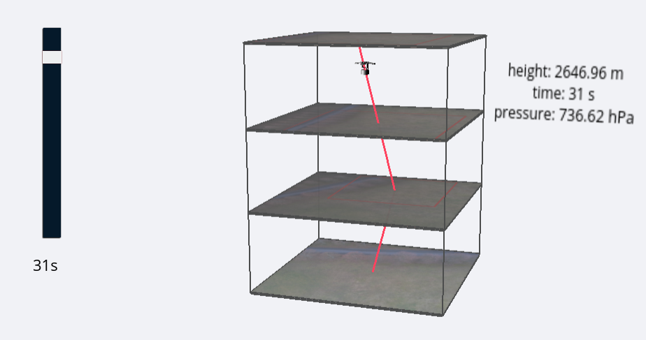
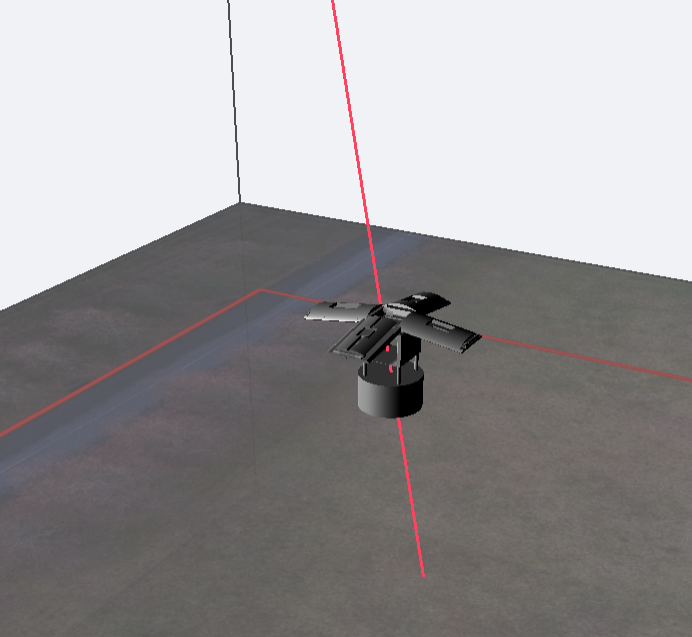
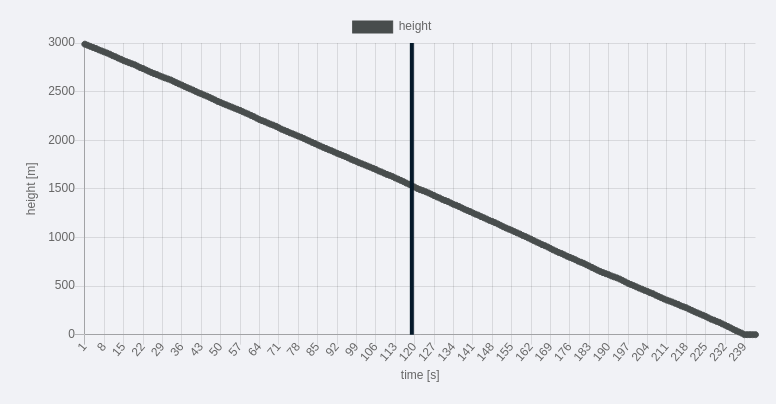

# CanSat 3D Map

3D Model created for the CanSat competition. It shows images taken from different heights by probe and detects a flight trajectory. Map also contains charts with data received from the probe.

## Used technologies

- JS Libraries:
  - Three.js (building model)
  - OrbitControlls.js (rotating a model)
  - Chart.js (showing charts)
- CSS Libraries:
  - loading io (loading spinner)
- Tools:
  - Gulp
  - Webpack
  - Eslinter
  - Prettier
- Database:

  - Firestore

  ## Practice usage

  ### 3D Map

  The main task of Model 3D is to show the pictures coming from [Image finder algorithm](https://github.com/Iwaniukooo11/image-finder). It works perfect with the use of three.js. Thanks the config about coordinates of red rectangle coming from database, there is automatically building a line showing the flight trajectory. It is possible to select a second from the free fall of probe and see some data, which were collected and the CanSat position at this time.
  
  Example map with real collected data and images.

  
  Model symbolizing our falling probe.

### Charts

Depending on the size of using device, charts can appear on the right side or under the map.
Each chart represents some part of data collected by CanSat. It is possible to hover the part of diagram and see more detailed informations about data from specific part of time. There also appears a vertical line which is resposnsible for showing current selected time.

One of charts basing on real collected data.

## Author

**Mateusz Iwaniuk** as a member of [Project Trailblazer](http://www.project-trailblazer.pl/) Team.

## Live

[Live version is avaliable here](https://iwaniukooo11.github.io/cansat_model3d/)
